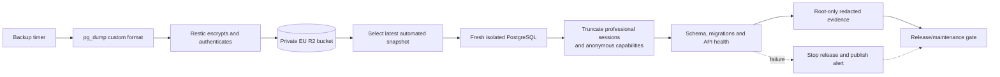

# Implemented encrypted recovery flow

This diagram describes the Restic/R2 backup and isolated restoration path used
by release and maintenance gates. It contains no populated credentials or
runtime values.

The live Compose project is never used as the restore target. The isolated
exercise verifies the deployed revision, report count, schema/migrations and
health endpoint, and proves that sessions and capabilities are not revived.
Retention, failure handling and the exact command boundary are maintained in
the [backup and recovery runbook](../../operations/backup-and-recovery.md).
