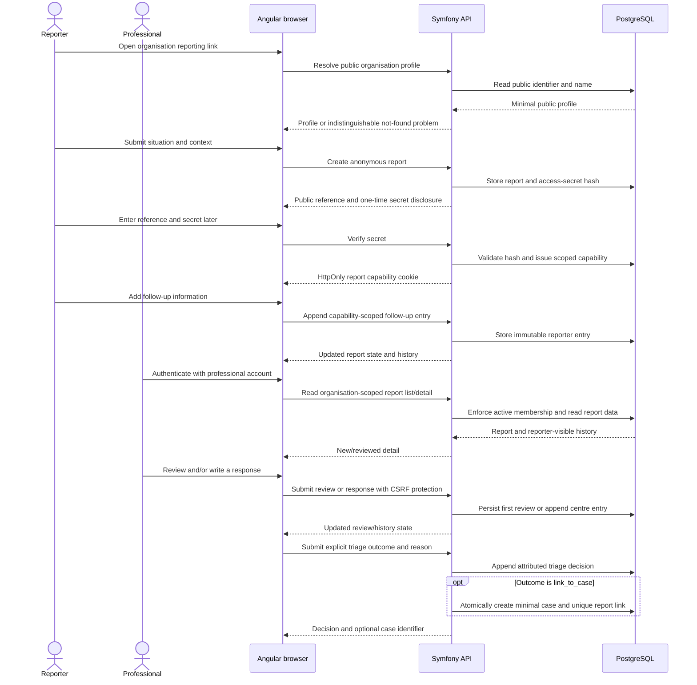

# Implemented reporting sequence

This sequence covers the current anonymous report and follow-up journey plus
the professional review/response path. It deliberately omits future case
management, email, attachments and analytics.

The public reference is a receipt, not authentication. The secret is never
stored in readable form; the capability is scoped to one report and is not
placed in application-controlled browser storage. Professional access is
session-based and organisation-scoped. See ADR-0008, ADR-0010, ADR-0011 and
the generated [OpenAPI contract](../../api/openapi.yaml) for exact details.
