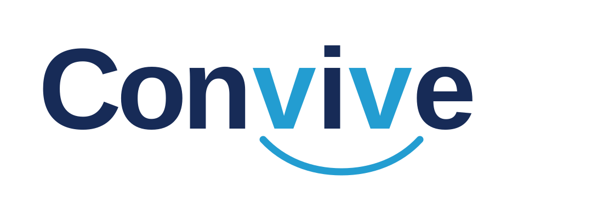

# Convive Brand Guidelines

This directory contains the current visual identity for Convive. It is intentionally small: the goal is to keep the project consistent without creating a large design system before the product needs one.

## Status

This is the first approved visual identity for Convive. It is the current source of truth and may be refined as the product evolves. Git history records previous versions; version numbers are not added to asset filenames.

## Brand idea

Convive connects two sides of the same problem: a person who needs to speak and a school team that needs to listen and act.

The two highlighted `v` letters represent those two sides. The curve connecting them represents support, continuity, and follow-up.

## Logo

Use the primary logo on white and very light backgrounds.

Available variants:

- `convive-logo.svg`: primary two-colour logo for light backgrounds.
- `convive-logo.png`: portable preview of the primary logo.
- `convive-logo-monochrome.svg`: single-colour logo when colour reproduction is unavailable.
- `convive-logo-reversed.svg`: light logo for dark navy backgrounds.
- `convive-logo-reversed.png`: portable preview for dark backgrounds.
- `convive-mark.svg`: compact product mark for favicons and other small digital uses.

The SVG files are the editable source assets. Use the PNG files only when the target application cannot work reliably with SVG.

Keep clear space around the logo equal to at least one quarter of its total height. Do not place text, borders, or other marks inside this area.

For digital use, do not display the full logo below 180 px wide. At smaller sizes, use the dedicated compact mark so that the two connected sides remain legible.

Do not:

- Stretch, rotate, or distort the logo.
- Change individual letter colours.
- Remove or redraw the connection curve.
- Add shadows, outlines, gradients, or effects.
- Place the primary logo on a background that reduces legibility.
- Add a tagline directly to the logo artwork.

## Colour palette

| Role       | Name            | Hex       | Intended use                                         |
| ---------- | --------------- | --------- | ---------------------------------------------------- |
| Primary    | Convive Navy    | `#172B57` | Headings, primary text, dark backgrounds             |
| Accent     | Voice Blue      | `#239DD1` | Highlighted `v` letters, connection gesture, accents |
| Background | Soft Background | `#F7FAFD` | Light sections and presentation backgrounds          |
| Neutral    | Supporting Grey | `#53647D` | Secondary text                                       |
| Neutral    | White           | `#FFFFFF` | Main backgrounds and reversed content                |

Voice Blue is an accent colour. It must not be used for normal-sized text on white because that combination does not meet WCAG 2.2 AA contrast requirements. Convive Navy and Supporting Grey can be used for normal text on white.

Never communicate meaning through colour alone. Pair status colours with text, icons, or another non-colour indicator.

## Typography

### Logo

The current wordmark is based on Trebuchet MS Bold. The approved SVG asset should be used instead of recreating the logo with typed text.

### Presentations and documents

Use Aptos for presentation and document content:

- Aptos Display Bold for major headings when available.
- Aptos Bold for section headings.
- Aptos Regular for body text.

Use Trebuchet MS Bold only for short brand-led headings when a closer visual relationship with the wordmark is useful.

### Product interface

The application typeface will be selected during interface design. It must prioritise readability, language support, web delivery, and accessibility. The presentation typography does not predetermine the technical frontend choice.

## Visual tone

Convive should feel:

- Direct, but never demanding.
- Young and approachable, but not childish.
- Safe and calm, but not clinical.
- Professional, but not bureaucratic.

Use generous spacing, clear hierarchy, short messages, and restrained use of Voice Blue. Avoid alarmist imagery, police-like symbols, depictions of violence, and imagery that labels someone as a victim or aggressor.

## Brand board

The visual summary is available as an editable SVG and a portable PNG:

- `assets/convive-brand-board.svg`
- `assets/convive-brand-board.png`

The SVG is the source. The PNG is a generated preview for GitHub, presentations, and sharing.

## Product interface foundations

The anonymous reporting flow establishes the first approved product-interface direction. These foundations should be reused across public and professional journeys, while allowing each journey to have its own information architecture.

### Interface principles

- Lead with the task. Avoid marketing, onboarding and explanatory content inside operational journeys.
- Use short, literal Spanish copy. Explain consequences before asking for an important action.
- Keep layouts calm and spacious, but do not fill empty space with decorative content.
- Give every screen one clear primary purpose and avoid competing calls to action.
- Keep anonymous reporting, anonymous follow-up and professional case management as separate interfaces connected by explicit actions.

### Visual language

- Use Convive Navy (`#172B57`) for headings, primary actions and high-emphasis interface elements.
- Use Voice Blue (`#239DD1`) for progress, completion and restrained accents, never as normal-sized text on white.
- Use white surfaces over very light cool backgrounds, with subtle blue-grey borders and low-opacity shadows.
- Prefer rounded rectangles with moderate radii. Current reporting surfaces use approximately `0.65rem` for controls and `1rem` for major containers.
- Use generous, consistent spacing and align content to a clear shared column. Related labels, values and actions must remain visually grouped.
- Use icons to support familiar actions such as copy or completion, always with an accessible text label.

### Typography and hierarchy

- The current web interface uses Arial with Helvetica and sans-serif fallbacks while the final product typeface remains open.
- Headings use Convive Navy, compact line heights and strong weight.
- Utility actions and progress labels at the same hierarchy level must use matching font sizes.
- Body and supporting text use Supporting Grey or another tested accessible neutral.
- Avoid oversized headings on mobile and prevent glyph clipping by using explicit, comfortable line heights.

### Forms and journeys

- Break demanding public tasks into a small number of understandable steps.
- Show the current step on every relevant viewport and keep progress visually continuous.
- Use large input targets, visible labels, clear focus states and errors next to the affected action or field.
- Selection rules must be reflected both visually and semantically; mutually exclusive options cannot appear selected together.
- Review screens should present only information the person can verify before submitting.

### Completion and sensitive credentials

- Treat the submission result as a final receipt, not another form step.
- Keep the public reference visually available but secondary to the access secret.
- Explain that the secret cannot be recovered before displaying the copy action.
- Keep the secret out of URLs and browser storage. A browser leave warning is only a secondary safeguard and is not reliable on all mobile lifecycle events.
- Confirmation, anonymous follow-up and adding further information are distinct views. Future actions may link from the receipt to follow-up, but the receipt must not embed the case interface.

### Accessibility and motion

- Meet WCAG 2.2 AA contrast and keyboard requirements.
- Never use colour or an icon as the only carrier of meaning.
- Provide visible focus indicators and accessible names for icon-only controls.
- Announce asynchronous status changes without unexpectedly moving focus.
- Respect reduced-motion preferences and provide controls for any prolonged automatic animation.

These foundations document the approved direction, not a complete design system. Repeated values should move into shared design tokens and reusable components when a second product journey proves that abstraction useful.
