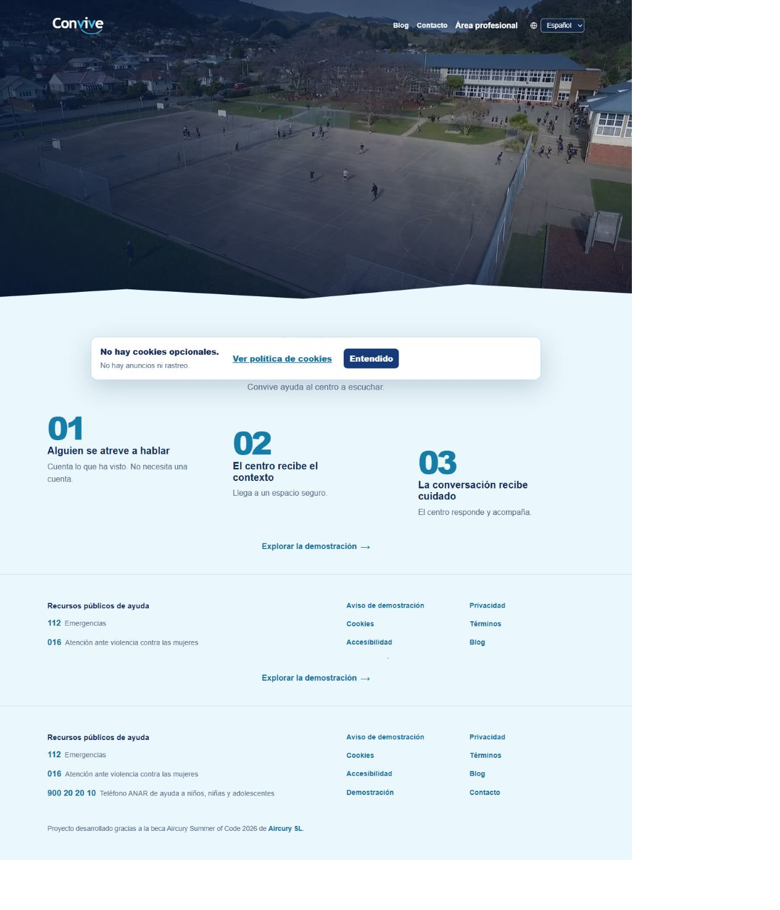
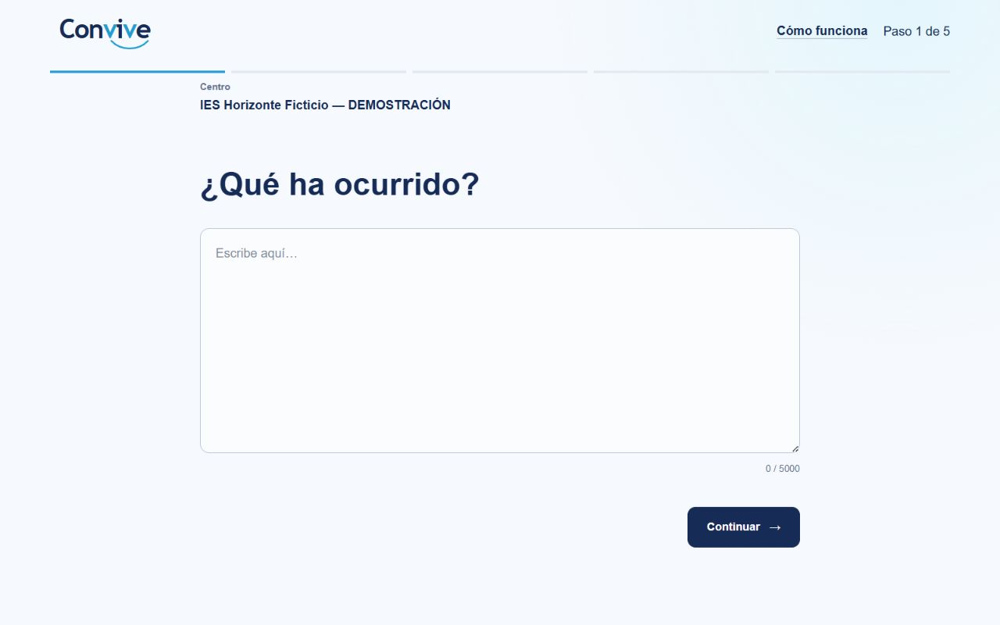
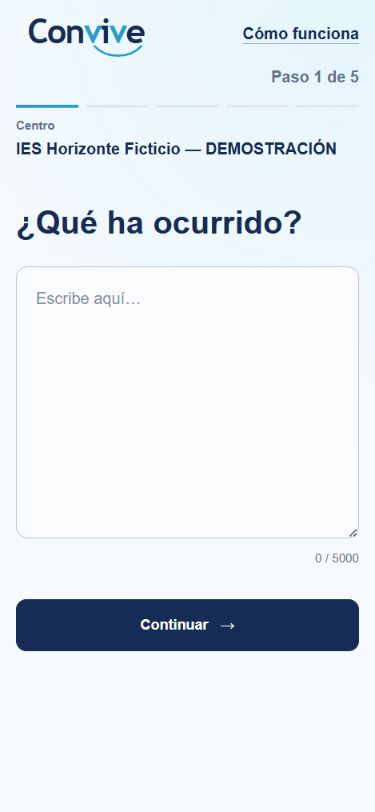
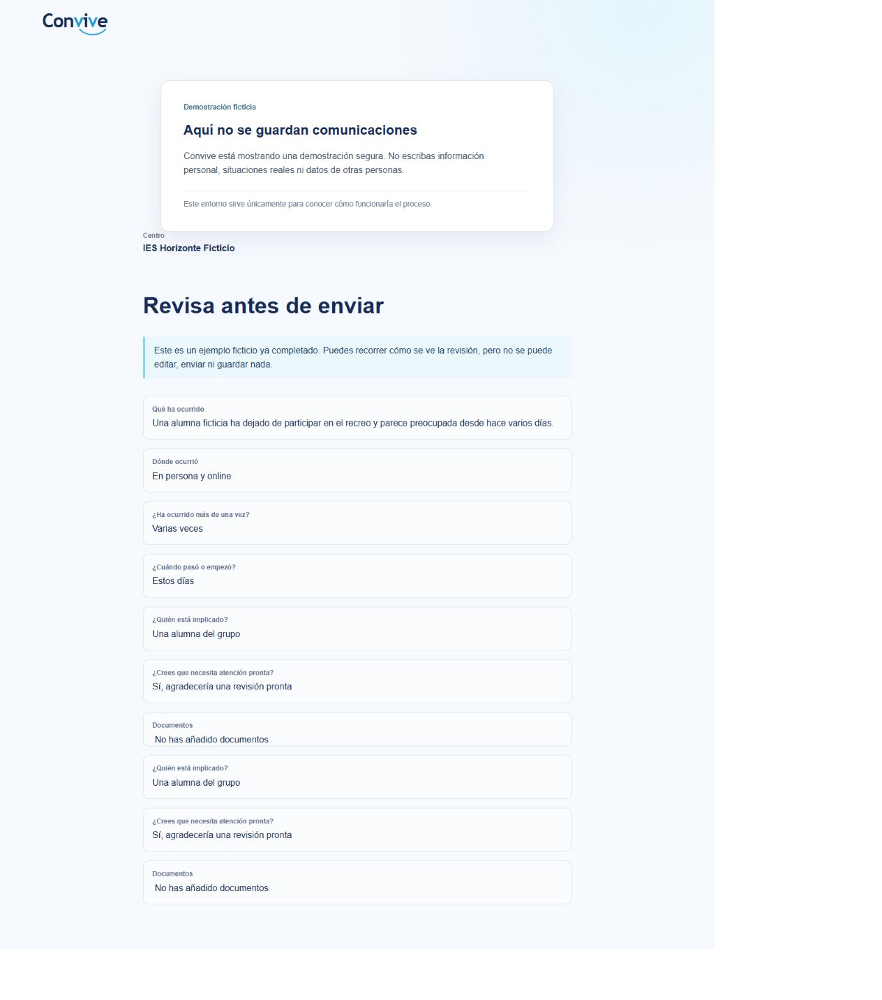
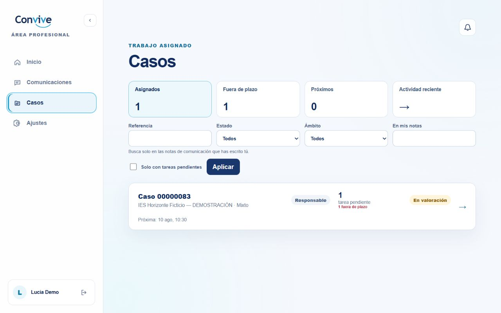
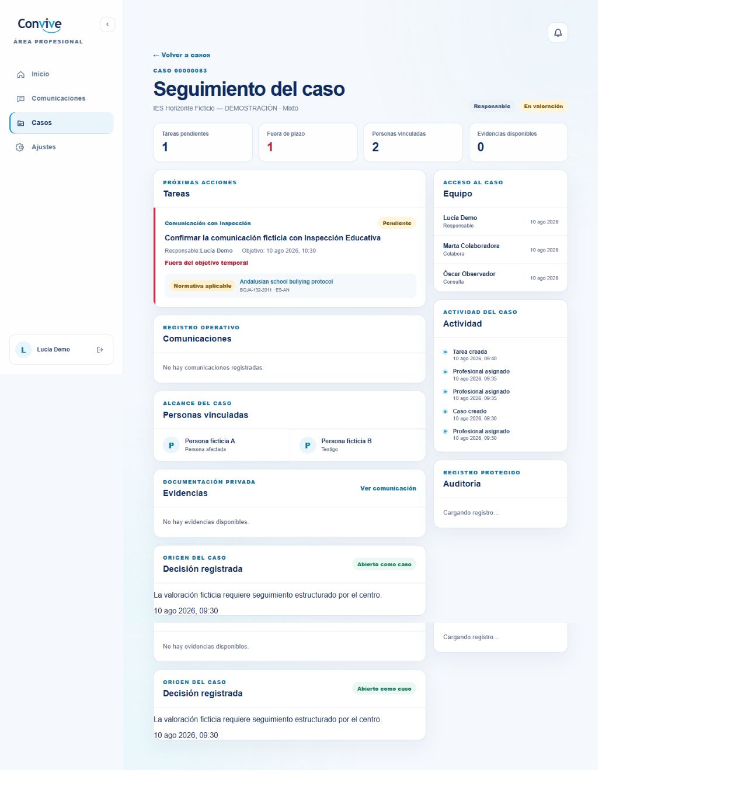
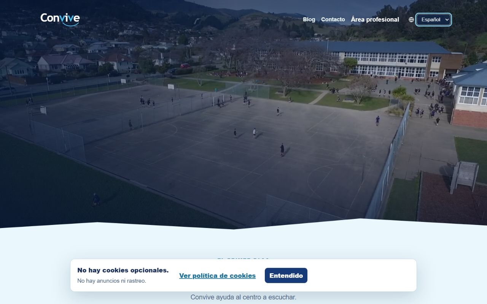

# Convive

Convive is an open-source web application for secure student reporting and internal school case management.

A student can report something happening to them, or to someone else, without
creating an account. School staff review what arrives, decide whether it
becomes a case, and work that case against **their own region's protocol** —
the one that actually applies to them, cited with its source, its authority and
its version.

## The three ways in

|                       | Who it serves                                  | Where                               |
| --------------------- | ---------------------------------------------- | ----------------------------------- |
| **Public website**    | Anyone reading about Convive                   | `conviveaula.com`                   |
| **Reporting entry**   | A student, with no account, reached per school | `app.conviveaula.com/r/<school>`    |
| **Professional area** | School staff, signed in                        | `app.conviveaula.com/profesionales` |

Administration is a **role inside the professional area**, not a fourth system.
[docs/access-map.md](docs/access-map.md) maps all of it, including what
deliberately does not exist and why there are no demo credentials in this
repository.

## Fictional product evidence

Every capture below uses the reviewed fictional demonstration. It contains no
credential, real person or real school data. The public reporting route shown
in the captures is a safe demonstration: it explains the real interface but
does not persist a communication.

1. **Public home.** The public entry point separates product information from
   reporting and introduces the fictional demonstration.

   

2. **Reporting entry.** A person reaches the reporting journey from a
   school-specific link without creating an account.

   

3. **Reporting entry on mobile.** The same no-account journey at the size of a
   phone reached from the poster.

   

4. **Completed fictional example.** The public demonstration also shows a
   prepared, read-only example instead of storing a visitor's communication.

   

5. **Professional case list.** The fictional professional area presents the
   assigned workload and its operational filters.

   

6. **Protocol-aware case detail.** A task cites the applicable Andalusian
   protocol, including its authority and version, rather than inventing a
   generic workflow.

   

7. **Published locales.** The public header exposes the locale selector used
   for the six currently published public languages.

   

8. **School poster.** The generated A4 fictional poster connects the QR code
   and the printed reporting route to the same demo channel.

   

## What makes it different from a form

**It cites protocols instead of inventing them.** Nineteen jurisdictions are
modelled — the seventeen autonomous communities plus Ceuta and Melilla — each
against its own published protocol, read in full rather than summarised from
secondary reporting. Each task template names the document it came from, its
authority (`binding`, `recommended` or `internal`) and its version.

Convive **states what a protocol says and calculates nothing**. Where a source
sets a deadline, the deadline is quoted with its own units — Madrid's _días
lectivos_ and _días naturales_ stay distinct because the source distinguishes
them. Where a source sets none, as Galicia and Navarra do, none is invented,
and a test forbids one appearing later.

**A report is not a case.** Nothing is promoted automatically. A person
decides, and the decision is recorded.

**It never promises absolute anonymity**, because that would be a false
reassurance, and the public copy says so in those terms.

## Overview

Convive addresses two connected problems:

1. Students may avoid reporting possible bullying situations because of fear, retaliation or lack of trust in existing channels.
2. School staff need a secure and traceable way to assess reports, document decisions, manage actions and follow up on internal cases.

Convive separates an initial report from an internal case. A report does not automatically become a confirmed bullying case. It must first be reviewed by authorised school staff.

The initial product is designed for development and demonstration with fictional data. It is not ready to process real student, family, professional or school information.

## Project status

Convive is a publicly deployed, fictional-data-only demonstration. It is not
authorised to process real student, family, professional or school information.

The current implementation provides:

- an Angular 22 web application;
- a Symfony 7.4 API running on PHP 8.5;
- PostgreSQL 18.4 with Doctrine ORM, DBAL and Migrations;
- Docker Compose development infrastructure;
- a versioned API namespace under `/api/v1`;
- an operational API health endpoint and same-origin development proxy;
- a public product homepage, kept separate from direct reporting and the
  authenticated application by host responsibility;
- the initial `Organisations` and `Reporting` domain model;
- persistence for organisations and anonymous reports;
- persisted public reporting identifiers and repository resolution for
  organisations;
- a public anonymous report submission endpoint with RFC 9457 Problem Details
  error handling;
- an accessible, mobile-friendly Angular reporting journey reached through an
  organisation's public reporting identifier;
- a generated OpenAPI 3.1 contract with continuous-integration drift detection;
- Doctrine migrations and fictional development fixtures;
- domain, HTTP and PostgreSQL integration tests;
- Chromium end-to-end coverage for anonymous submission and follow-up;
- automated backend, frontend and infrastructure checks through GitHub Actions.

In development, `localhost` makes both host responsibilities available for
verification. In the deployed public boundary, `https://conviveaula.com`
serves product information while `https://app.conviveaula.com` serves the
direct reporter and professional routes. The public route
`/r/{publicReportingIdentifier}` remains on the application host and submits
reports through the same-origin API proxy. See
[ADR-0014](docs/architecture/decisions/0014-separate-public-website-and-application-domains.md)
for the canonical routes and security boundaries.

The first reporting data model stores the minimum information required to
receive an anonymous report securely. Organisations have persisted public
reporting identifiers that can be resolved independently from their internal
UUIDs, and the backend already accepts anonymous report submissions through the
public API described below.

The anonymous journey covers text submission, situation context, review,
one-time presentation of access credentials and capability-based follow-up.
Private fictional attachments and optional verified generic email notices are
implemented for development with isolated Mailpit delivery. Production email
remains disabled until a provider, sender identity and real-data controls are
approved; the professional workflows shown publicly remain fictional-demo
workflows only.

Development and demonstrations must use fictional data only.

## Architecture

Convive is organised as a monorepository containing:

```text
apps/
├── api/     Symfony backend
└── web/     Angular frontend

docs/
├── architecture/
├── brand/
└── discovery/

infrastructure/
├── backup/       Versioned recovery automation and non-secret examples
├── compose/      Development container topology
├── maintenance/  Versioned maintenance and support checks
├── production/   Production images, gateway and Compose boundary
└── release/      Controlled release reconciliation script
```

Infrastructure automation belongs in this repository so that it can be
reviewed, tested and reproduced. Populated production configuration, secrets,
backup objects and runtime recovery evidence remain outside Git on the target
host or approved external provider, as documented in the operational runbooks.

Long-term demonstration ownership, maintenance cadence, renewal gates and
retirement/transfer procedures are documented in
[`docs/operations/maintenance-and-support.md`](docs/operations/maintenance-and-support.md).

The backend follows a modular-monolith architecture. Each module owns its domain and persistence boundaries while sharing one Symfony application and one PostgreSQL database.

The initial backend modules are:

- `Organisations`: educational organisations that can receive reports;
- `Reporting`: anonymous report intake and persistence;
- `Professionals`: professional identities, organisation memberships and roles;
- `Shared`: cross-cutting technical presentation infrastructure.

The frontend communicates with Symfony through a resource-oriented JSON HTTP API under `/api/v1`. It never accesses PostgreSQL directly.

The reasoning behind the principal technical decisions is recorded in the project’s architecture decision records.

## Requirements

The canonical development environment requires:

- Git;
- Docker Desktop with Docker Compose;
- a web browser.

PhpStorm is the primary development IDE, but it is not required to run the application.

PHP, Composer, Node.js and PostgreSQL do not need to be installed directly on the host. Application runtimes and dependencies execute inside containers.

## Clone the repository

```bash
git clone https://github.com/albertogalvez-dev/Convive.git
cd Convive
```

## Prepare backend dependencies

The Symfony source directory is mounted into the development container. On the first run after cloning the repository, install its locked Composer dependencies through Docker:

```bash
docker compose \
  -f infrastructure/compose/compose.yaml \
  -f infrastructure/compose/compose.development.yaml \
  run --rm --build --no-deps api composer install \
  --prefer-dist \
  --no-interaction \
  --no-progress
```

This command builds the API development image, installs the exact dependency
versions recorded in `composer.lock` and creates the ignored
`apps/api/vendor` directory without requiring PHP or Composer on the host.

Run it again whenever `composer.lock` changes or `apps/api/vendor` is removed.

## Start the development environment

From the repository root, start the common and development Compose configurations together:

```bash
docker compose \
  -f infrastructure/compose/compose.yaml \
  -f infrastructure/compose/compose.development.yaml \
  up --build
```

In PhpStorm, the same environment can be started with a Docker Compose run configuration using these files in this order:

1. `infrastructure/compose/compose.yaml`
2. `infrastructure/compose/compose.development.yaml`

The environment starts three services:

- `web`: Angular development server with automatic reload;
- `api`: Symfony development server;
- `database`: PostgreSQL.

## Apply database migrations

With the services running, apply the committed Doctrine migrations:

```bash
docker compose \
  -f infrastructure/compose/compose.yaml \
  -f infrastructure/compose/compose.development.yaml \
  exec api php bin/console doctrine:migrations:migrate --no-interaction
```

## Load fictional development data

The development fixture creates a fictional educational organisation for local testing.

Loading fixtures purges the existing development data. Do not run this command against a database containing information that must be preserved.

```bash
docker compose \
  -f infrastructure/compose/compose.yaml \
  -f infrastructure/compose/compose.development.yaml \
  exec api php bin/console doctrine:fixtures:load --no-interaction
```

All fixtures must remain fictional.

Development fixtures are not the public demonstration dataset. The production
demo uses the explicit, non-fixture mechanism documented in
[`docs/operations/fictional-demo-data.md`](docs/operations/fictional-demo-data.md);
it never runs automatically during startup or migrations.

## Local addresses

Once the services are running:

- Angular application: `http://127.0.0.1:4200`
- Symfony health endpoint: `http://127.0.0.1:8000/api/v1/health`
- PostgreSQL: `127.0.0.1:5432`

The Angular page should display:

```text
API status: ok
```

This confirms the complete development request path:

```text
Browser -> Angular -> development proxy -> Symfony -> Angular
```

PostgreSQL readiness, migrations and Doctrine schema validity are verified separately.

## Public reporting API

The backend exposes two public reporting operations:

```text
GET  /api/v1/public/organisations/{publicReportingIdentifier}
POST /api/v1/public/organisations/{publicReportingIdentifier}/reports
```

The organisation is addressed through its public reporting identifier rather
than its internal UUID, as decided in
[ADR-0009](docs/architecture/decisions/0009-use-public-organisation-reporting-links.md).

The profile operation lets the reporting journey validate the public link and
display the organisation name before accepting any report content. A successful
response contains only that public name. Malformed and unknown identifiers share
the same `404 Not Found` representation so the endpoint does not disclose
internal organisation data.

A successful submission returns `201 Created` with the report's public reference
and its access secret. The access secret is returned only once and is never
stored in readable form, so the reporter must save it to consult the report
later. Errors use RFC 9457 Problem Details.

The complete contract is described in
[`docs/api/openapi.yaml`](docs/api/openapi.yaml). Continuous integration
regenerates the contract and fails on drift.

## Prepare the test database

The PostgreSQL integration tests use a separate `convive_test` database.
The Compose development environment injects a test-only session DSN when
`APP_ENV=test`, so the command below does not need a manual
`SESSION_DATABASE_URL` override and never writes professional sessions to the
development database.

Create it if it does not already exist:

```bash
docker compose \
  -f infrastructure/compose/compose.yaml \
  -f infrastructure/compose/compose.development.yaml \
  exec api php bin/console doctrine:database:create \
  --env=test \
  --if-not-exists
```

Apply the migrations to the test database:

```bash
docker compose \
  -f infrastructure/compose/compose.yaml \
  -f infrastructure/compose/compose.development.yaml \
  exec api php bin/console doctrine:migrations:migrate \
  --env=test \
  --no-interaction
```

## Verification

### Validate Composer configuration

```bash
docker compose \
  -f infrastructure/compose/compose.yaml \
  -f infrastructure/compose/compose.development.yaml \
  exec api composer validate --strict
```

### Audit backend dependencies

```bash
docker compose \
  -f infrastructure/compose/compose.yaml \
  -f infrastructure/compose/compose.development.yaml \
  exec api composer audit --locked
```

### Run backend static analysis

```bash
docker compose \
  -f infrastructure/compose/compose.yaml \
  -f infrastructure/compose/compose.development.yaml \
  exec api composer analyse
```

### Validate Symfony configuration

```bash
docker compose \
  -f infrastructure/compose/compose.yaml \
  -f infrastructure/compose/compose.development.yaml \
  exec api php bin/console lint:yaml config --parse-tags
```

```bash
docker compose \
  -f infrastructure/compose/compose.yaml \
  -f infrastructure/compose/compose.development.yaml \
  exec api php bin/console lint:container
```

### Validate the Doctrine schema

```bash
docker compose \
  -f infrastructure/compose/compose.yaml \
  -f infrastructure/compose/compose.development.yaml \
  exec api php bin/console doctrine:schema:validate
```

### Execute backend tests

```bash
docker compose \
  -f infrastructure/compose/compose.yaml \
  -f infrastructure/compose/compose.development.yaml \
  exec api php bin/phpunit
```

Some HTTP tests intentionally send unsupported requests. Symfony may log the expected exception while PHPUnit still reports a successful test run.

### Check frontend formatting

```bash
docker compose \
  -f infrastructure/compose/compose.yaml \
  -f infrastructure/compose/compose.development.yaml \
  exec web npm exec prettier -- \
  --check "src/**/*.{ts,html,scss}" "*.{json,md}"
```

### Type-check the frontend

```bash
docker compose \
  -f infrastructure/compose/compose.yaml \
  -f infrastructure/compose/compose.development.yaml \
  exec web npm run typecheck
```

### Audit production frontend dependencies

```bash
docker compose \
  -f infrastructure/compose/compose.yaml \
  -f infrastructure/compose/compose.development.yaml \
  exec web npm audit --omit=dev
```

### Execute frontend tests

```bash
docker compose \
  -f infrastructure/compose/compose.yaml \
  -f infrastructure/compose/compose.development.yaml \
  exec web npm test -- --watch=false
```

### Create the Angular production build

```bash
docker compose \
  -f infrastructure/compose/compose.yaml \
  -f infrastructure/compose/compose.development.yaml \
  exec web npm run build
```

### Execute the Chromium end-to-end journey

The end-to-end suite uses a dedicated fictional organisation and never reloads
Doctrine fixtures. Follow the isolated Docker-based preparation and execution
steps in [`docs/testing/playwright.md`](docs/testing/playwright.md).

The [layered testing strategy](docs/testing/strategy.md) explains which risks
belong in each automated layer and how to handle a failure without hiding it.

Once that stack is ready, install the pinned Chromium build and run the suite
from `apps/web`:

```bash
npm run e2e:install
npm run e2e
```

Failure output deliberately disables traces and video. It retains only a
redacted screenshot and textual context that must not contain the report access
secret.

### Validate Docker Compose

```bash
docker compose \
  -f infrastructure/compose/compose.yaml \
  -f infrastructure/compose/compose.development.yaml \
  config --quiet
```

GitHub Actions repeats the backend, frontend and infrastructure checks for every pull request and for changes pushed to `main`.

## Stop the development environment

Stop the foreground Compose process with `Ctrl+C`, or use the Stop action in PhpStorm.

To remove the development containers and networks while preserving the PostgreSQL volume:

```bash
docker compose \
  -f infrastructure/compose/compose.yaml \
  -f infrastructure/compose/compose.development.yaml \
  down
```

Removing the named database volume permanently deletes the local development database and should only be done intentionally.

## Development data and secrets

The committed development database credentials are fictional and intended only for the local Docker environment. They must never be reused in production.

Do not commit:

- real personal, student, family, professional or school data;
- production credentials;
- private keys;
- access secrets or session identifiers;
- `.env.local` files;
- environment-specific local overrides;
- generated dependency or build directories.

Anonymous report references, report access secrets and organisation public
reporting identifiers serve different purposes. Internal UUIDs are not
authentication credentials and must not be exposed as public routing
identifiers or used as access secrets.

The public demonstration and all development environments must use fictional data until the necessary legal, privacy, security and operational conditions for real use have been formally validated.

## Documentation

- [How to reach each part of Convive](docs/access-map.md)
- [Documentation index](docs/README.md)
- [Problem statement](docs/discovery/problem-statement.md)
- [Product scope](docs/discovery/product-scope.md)
- [Regulatory context](docs/discovery/regulatory-context.md)
- [Architecture overview](docs/architecture/README.md)
- [Architecture diagram catalogue](docs/architecture/diagrams/README.md)
- [Initial system architecture](docs/architecture/diagrams/initial-system-architecture.md)
- [Implemented reporting sequence](docs/architecture/diagrams/reporting-sequence.md)
- [Encrypted recovery flow](docs/architecture/diagrams/recovery-flow.md)
- [Initial data model](docs/architecture/diagrams/data-model.md)
- [DBML data-model source](docs/architecture/data-model.dbml)
- [OpenAPI contract](docs/api/openapi.yaml)
- [Architecture decision records](docs/architecture/decisions/README.md)
- [Operations runbooks](docs/operations/README.md)
- [Development log](docs/development-log.md)
- [Brand assets and usage](docs/brand/README.md)

The Doctrine mappings and committed migrations are authoritative for the executable database schema. Diagrams and DBML provide reviewed documentation of that model.

## Contributing

Convive is currently being developed through focused GitHub issues, short-lived branches and reviewed pull requests.

See [CONTRIBUTING.md](CONTRIBUTING.md) for the full workflow, local verification commands and code style expectations, and the [Code of Conduct](CODE_OF_CONDUCT.md) for participation standards.

## Security

Convive is not ready for deployment with real personal data.

See [SECURITY.md](SECURITY.md) for the private vulnerability-reporting process. Do not disclose a security concern through a public issue.

The maintained [threat model and privacy engineering
register](docs/security/README.md) record implemented controls, residual risks
and the gates keeping the demonstration restricted to fictional data.

## License

This project is released under the MIT License. See [LICENSE](LICENSE). See
[NOTICE](NOTICE.md) for the scholarship acknowledgement required by the
Aircury Summer of Code 2026 programme.
