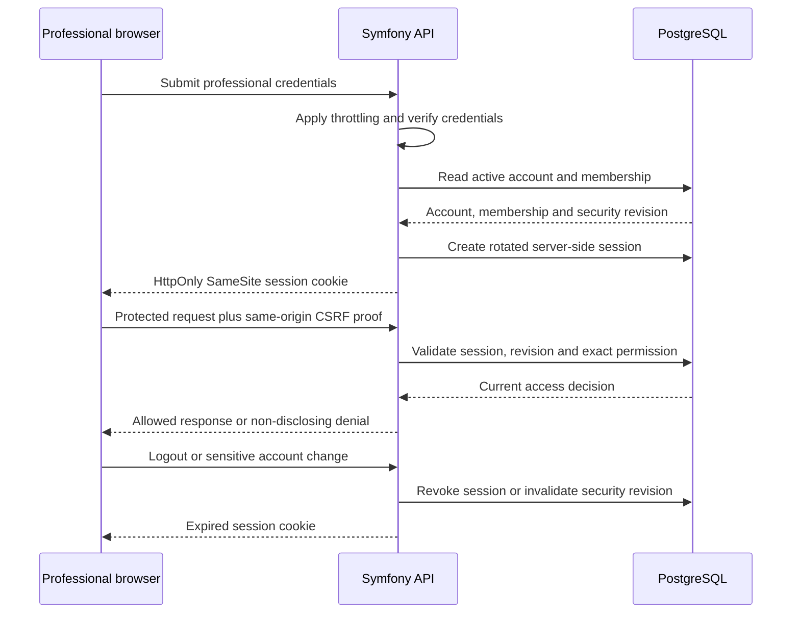
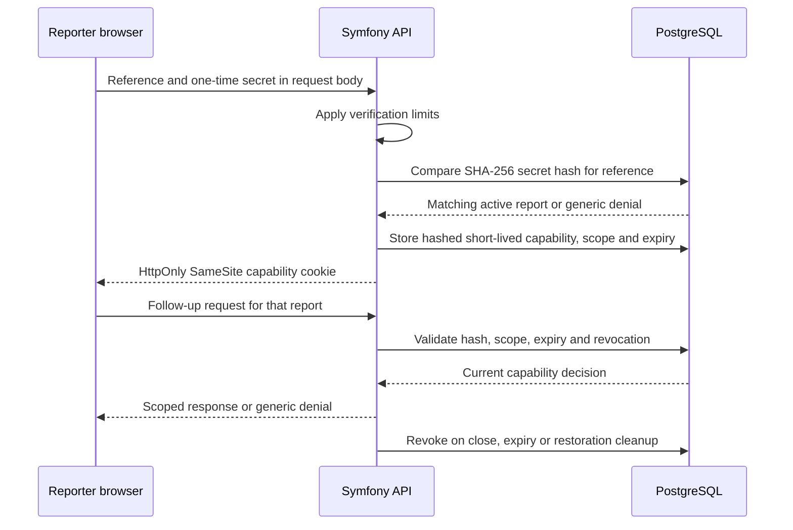

# Professional sessions and anonymous capabilities

Verified against ADR-0008, ADR-0010, ADR-0011 and the current Symfony
authenticators on 24 August 2026.

**The property this diagram makes explicit: anonymous possession of a report
secret never becomes professional authority.**

## Professional session

The browser receives only an opaque session identifier. PostgreSQL remains the
authoritative session store, so a suspension, role change or security-revision
change invalidates earlier sessions. A valid organisation role still does not
grant case content: the protected case operation also requires the exact active
assignment defined in [ADR-0018](../decisions/0018-require-case-assignments-for-case-content.md).

## Anonymous reporter capability

The reference is a receipt identifier, not authentication. The secret is shown
once, stored only as a hash and never written by the application to browser
storage. The capability is limited to one report and cannot call professional
routes, while professional sessions cannot impersonate a reporter capability.

## Verification sources

- [ADR-0008](../decisions/0008-use-server-side-sessions-and-capability-based-anonymous-access.md)
- [ADR-0010](../decisions/0010-use-a-single-secret-for-anonymous-report-access.md)
- [ADR-0011](../decisions/0011-allow-the-reporter-browser-password-manager-to-store-the-access-secret.md)
- [Authorisation model](authorisation-model.md)
- Generated [OpenAPI contract](../../api/openapi.yaml)
