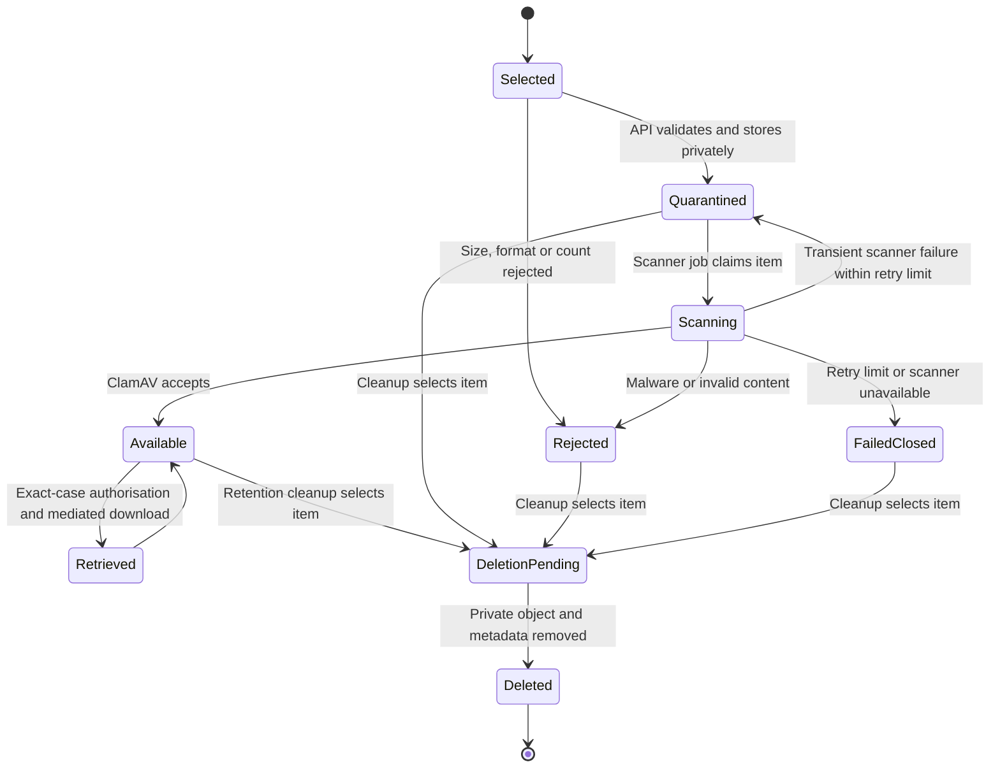

# Private attachment lifecycle and scan boundary

Verified against the [attachment threat model](../../security/attachment-threat-model.md),
the [attachment lifecycle runbook](../../operations/attachment-lifecycle.md)
and the production Compose boundary on 24 August 2026.

**The property this diagram makes explicit: no attachment becomes available
until scanning succeeds, and no attachment storage is public.**

The browser never receives a storage credential or public object URL. Symfony
owns metadata, authorises the exact case request and mediates download. The
private volume is outside the web root; ClamAV is reachable only through the
internal scanning boundary. A scan error fails closed rather than exposing the
object or retrying indefinitely.

The documented cleanup path is limited to unmistakably fictional data. It does
not establish a real-data retention period, legal hold or deletion authority.

## Verification sources

- [Attachment threat model](../../security/attachment-threat-model.md)
- [Private attachment lifecycle runbook](../../operations/attachment-lifecycle.md)
- `infrastructure/maintenance/attachment-lifecycle.sh`
- `infrastructure/maintenance/test-attachment-lifecycle.sh`
- [Single-VPS deployment](single-vps-deployment.md)
