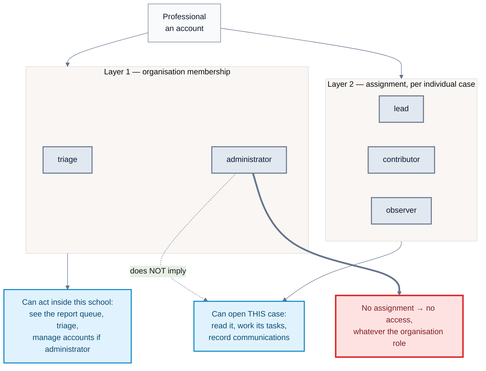

# Authorisation: organisation role versus case assignment

Verified against the codebase on 18 August 2026.

**The property this diagram exists to make obvious: being an administrator does
not grant access to a case you are not assigned to.**

Two layers are easy to collapse into one, and collapsing them is the mistake
this page exists to prevent. It is a mistake worth naming, because the author
of this diagram made it in a briefing document the same day — describing
"three roles: triage, administrator and observer", which mixes a role that
exists at organisation level with one that exists only per case.

## Reading it in one sentence

Organisation membership decides **what kind of work you may do at this school**.
Case assignment decides **which cases you may open at all**. The second is not
derived from the first.

## Why it is built this way

A case contains what a child said. Seniority is not a reason to read it. The
people who need it are the people working it, and being one of those is a
recorded act — someone assigned you, and that assignment has an author and a
reason.

The consequence is deliberate and occasionally inconvenient: an administrator
who needs to see a case must be assigned to it, and that assignment is visible.
There is no override, no "break glass", no role that quietly sees everything.

## Details worth knowing

- Organisation roles: `triage`, `administrator`. **Two**, not three.
- Case assignment roles: `lead`, `contributor`, `observer`. `observer` exists
  **only** here — it is not an organisation role.
- Assignments are explicit and revocable, and both the grant and the revocation
  carry a reason.
- Lead handover is atomic: a case does not pass through a state with no
  responsible person (ADR-0025).

## Related decisions

- [ADR-0018: Require explicit assignments for case content](../decisions/0018-require-case-assignments-for-case-content.md)
- [ADR-0023: Map Andalusian centre responsibilities to least-privilege grants](../decisions/0023-map-andalusian-centre-responsibilities-to-least-privilege-grants.md)
- [ADR-0025: Use explicit atomic case-lead handovers](../decisions/0025-use-explicit-atomic-case-lead-handovers.md)
