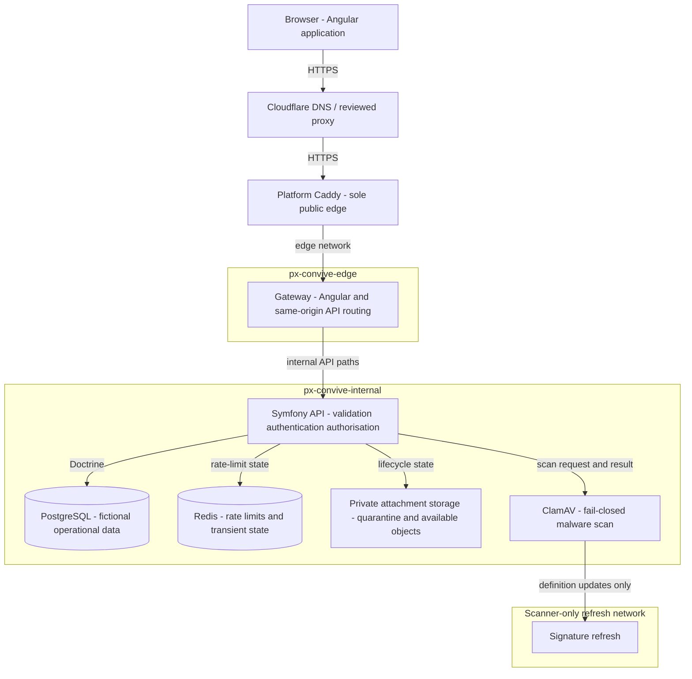

# C4 container

**Property made obvious:** only the gateway reaches the public edge; API, state and malware scanning stay on Convive-owned private networks.

**Status:** maintained fictional-demo runtime view  
**Last reviewed:** 25 August 2026

This container view describes the reviewed target runtime selected by [ADR-0029](../decisions/0029-use-the-platform-caddy-per-project-edge-for-public-ingress.md). It does not attest an active public deployment or permit real data.

## Containers

| Container | Purpose | Exposure and control |
| --- | --- | --- |
| Gateway | Serves compiled Angular and routes API requests to PHP-FPM | Only Convive service on `px-convive-edge`; no host port |
| Symfony API | Owns validation, capabilities, professional sessions, case access and audit rules | Internal only; Angular cannot grant authority |
| PostgreSQL | Stores fictional reports, cases, memberships, audit and lifecycle data | Named private volume and least-privilege credentials |
| Redis | Holds rate-limit and transient coordination state | Internal only and authenticated |
| Private attachment storage | Holds quarantined and safe fictional evidence | No public object URL; authorised retrieval only |
| ClamAV | Returns a fail-closed scan result before evidence is available | Internal scanner port and isolated signature refresh egress |

The evidence lifecycle is maintained in the [attachment lifecycle](attachment-lifecycle.md). Data classifications and trust boundaries are in the [security data-flow view](security-data-flow.md).

## Sources and verification

- [Production Compose topology](../../../infrastructure/production/compose.production.yaml)
- [Development Compose service contracts](../../../infrastructure/compose/compose.yaml)
- [Attachment security boundary](../../security/attachment-threat-model.md)
- `infrastructure/production/check-api-environment.sh`
- `npm run docs:check`
