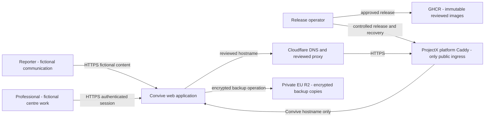

# C4 context

**Property made obvious:** Convive's public demonstration has one reviewed public edge, while reporter, professional and operator activities retain different authority and data boundaries.

**Status:** maintained fictional-demo context view  
**Last reviewed:** 25 August 2026

This is a logical context view, not proof that the public hostname is active. It follows [ADR-0029](../decisions/0029-use-the-platform-caddy-per-project-edge-for-public-ingress.md) and the [single-VPS deployment](single-vps-deployment.md). The demonstration contains fictional data only and does not authorise real reporting.

## Responsibilities and boundaries

| Element | Responsibility | Boundary that remains authoritative |
| --- | --- | --- |
| Reporter | Submits or follows a fictional communication with a one-time secret and scoped capability | Never becomes a professional session |
| Professional | Uses an authenticated membership and exact case assignment | Server-side Symfony authorisation, not Angular |
| Convive web application | Presents Angular and invokes the application API through the same origin | Does not expose data stores or attachment storage |
| Cloudflare | Owns DNS and may apply the reviewed proxy policy | It is neither a Tunnel connector nor application authorisation |
| Platform Caddy | Is the only public ingress and exposes the reviewed hostname | No Convive container port is published on the VPS |
| Release operator and GHCR | Approve and supply immutable image digests | Release stops when approval, digest or health evidence is absent |
| R2 backup repository | Holds encrypted off-host recovery copies | It is not part of the request path or public attachment delivery |

The runtime services are specified in the [C4 container view](c4-container.md). Security-sensitive flows are traced in the [security data-flow view](security-data-flow.md), and release decisions are shown in the [release and rollback sequence](release-rollback-sequence.md).

## Sources and verification

- [ADR-0029](../decisions/0029-use-the-platform-caddy-per-project-edge-for-public-ingress.md)
- [Production Compose topology](../../../infrastructure/production/compose.production.yaml)
- [Controlled release runbook](../../operations/deployment-release-and-rollback.md)
- `npm run docs:check`
