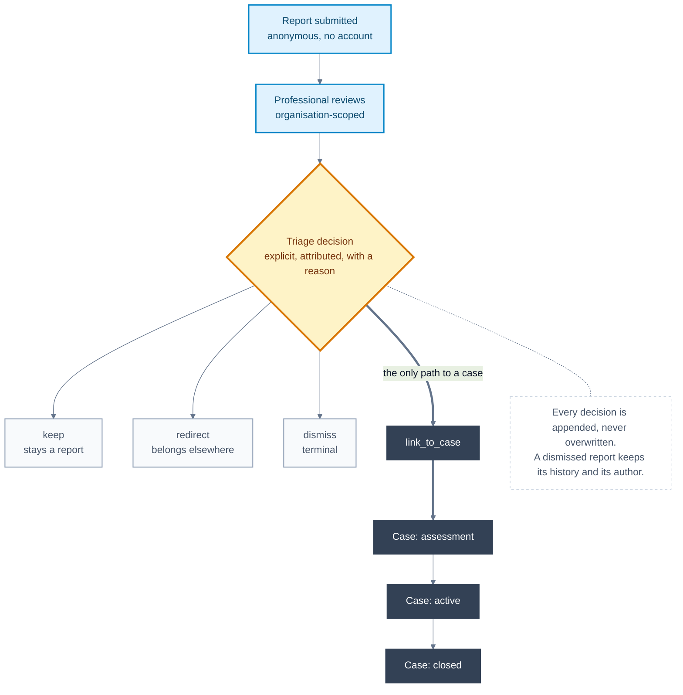

# Case lifecycle and the report/case boundary

Verified against the codebase on 18 August 2026.

**The property this diagram exists to make obvious: a report is not a case, and
nothing becomes a case without a person deciding it.**

Everything else here is detail. If a reader takes away only one thing, it
should be that the arrow from report to case is a human decision with a
recorded reason and an attributed author — not a status field advancing.

## Why the boundary exists

A report is what someone told the school. A case is what the school decided to
do about it. Collapsing the two would mean the product had judged a situation,
and Convive does not judge situations — a person does, and the record says who
and why.

This also protects the reporter. A report that turns out not to describe
bullying is not a failed case; it never became one, and nothing in the record
implies otherwise.

## What the diagram deliberately does not show

- **Case work itself** — tasks, assignments, communications, audit. Those
  belong to a case that already exists and would bury the boundary.
- **Attachments and follow-up.** They attach to a report and continue across
  the boundary; drawing them would add lines without changing the rule.

## Details worth knowing

- The four triage outcomes are `keep`, `redirect`, `dismiss` and
  `link_to_case`. Only the last one creates a case, and it creates the case and
  the unique report link **atomically** — a report cannot end up half-linked.
- Triage decisions are **append-only**. A later decision does not erase an
  earlier one, so the reasoning is reconstructable rather than replaced.
- Case status is `assessment`, `active` or `closed`. A case opens in
  `assessment`: the decision to open it is not itself a conclusion about the
  situation.

## Related decisions

- [ADR-0017: Model report triage as append-only decisions](../decisions/0017-model-triage-as-append-only-decisions.md)
- [ADR-0018: Require explicit assignments for case content](../decisions/0018-require-case-assignments-for-case-content.md)
- [ADR-0024: Use a versioned neutral triage taxonomy](../decisions/0024-use-a-versioned-neutral-triage-taxonomy.md)
