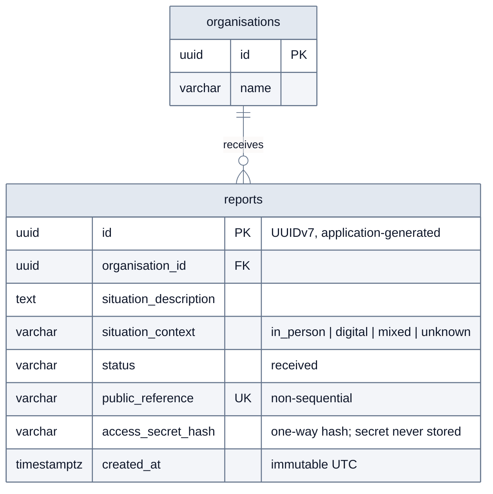

# Data model

Entity–relationship view of Convive's first domain schema (`organisations` and
`reports`). GitHub renders this diagram from its Mermaid source. It is kept in
sync with the Doctrine mappings, the committed migration and
[`data-model.dbml`](../data-model.dbml).

