# Data model

Entity–relationship view of Convive's domain schema. GitHub renders this
diagram from its Mermaid source. It is kept in sync with the Doctrine
mappings, the committed migrations and [`data-model.dbml`](../data-model.dbml).

```mermaid
%%{init: {'theme': 'base', 'themeVariables': {'primaryColor': '#E2E8F0', 'primaryTextColor': '#0F172A', 'primaryBorderColor': '#64748B', 'lineColor': '#64748B'}}}%%
erDiagram
    organisations {
        uuid id PK
        varchar name
        varchar public_reporting_identifier UK "ORG_ + 16 Crockford Base32 characters"
    }
    reports {
        uuid id PK "UUIDv7, application-generated"
        uuid organisation_id FK
        text situation_description
        varchar situation_context "in_person | digital | mixed | unknown"
        varchar reporter_timing "within_days | within_weeks | longer_ago | unknown"
        varchar reported_people "nullable; optional, reporter's own words"
        varchar status "received | reviewed; independent from triage"
        varchar public_reference UK "non-sequential"
        varchar access_secret_hash UK "64-char lowercase hex SHA-256; secret never stored"
        timestamptz created_at "immutable UTC"
        text review_reason "nullable until reviewed"
        uuid reviewed_by_professional_id FK "nullable until reviewed"
        timestamptz reviewed_at "nullable; immutable UTC"
        int attachment_count "reserved slots"
        int attachment_bytes "reserved bytes"
        int version "optimistic lock"
    }
    report_attachments {
        uuid id PK "UUIDv7; private metadata only"
        uuid report_id FK
        varchar media_type "PDF | JPEG | PNG"
        int byte_size "1 to 5 MiB"
        varchar content_hash "64-char SHA-256"
        varchar storage_key UK "private quarantine|available UUID key"
        varchar status "quarantined | scanning | available | rejected | deletion_pending | deleted"
        timestamptz created_at "immutable UTC"
        timestamptz scan_started_at "nullable"
        timestamptz resolved_at "nullable"
        timestamptz deletion_requested_at "nullable"
        timestamptz deleted_at "nullable"
        varchar description "nullable; bounded; no filename"
    }
    report_access_grants {
        uuid id PK "UUIDv7, application-generated"
        uuid report_id FK
        varchar capability_hash UK "64-char lowercase hex SHA-256"
        timestamptz issued_at "immutable UTC"
        timestamptz last_used_at "drives 15-minute idle timeout"
        timestamptz absolute_expires_at "issued_at + 2 hours"
        timestamptz revoked_at "nullable; set once"
    }
    report_follow_up_entries {
        uuid id PK "UUIDv7, application-generated"
        uuid report_id FK
        varchar author_type "reporter | professional"
        uuid professional_author_id "nullable; private audit metadata"
        text content "bounded to 2000 characters"
        timestamptz created_at "immutable UTC; append-only"
    }
    managed_cases {
        uuid id PK "UUIDv7; minimal case identity"
        uuid organisation_id FK
        uuid created_by_professional_id FK
        timestamptz created_at "immutable UTC"
        timestamptz operational_updated_at "latest explicit case, assignment or task activity"
        varchar status "assessment | active | closed"
        varchar status_reason "nullable; latest explicit lifecycle record"
        varchar status_evidence "nullable; latest operational evidence record"
        timestamptz status_changed_at "nullable"
        varchar modality "in_person | digital | mixed | unknown"
    }
    case_audit_events {
        uuid id PK "UUIDv7; append-only minimised event"
        uuid case_id FK
        uuid organisation_id FK "scope/order only; no organisation content"
        uuid actor_professional_id FK
        varchar action "minimised auditable action"
        varchar target "minimised target category"
        uuid target_id "internal correlation; never in protected response"
        timestamptz occurred_at "immutable UTC; bounded fictional retention"
    }
    case_assignments {
        uuid id PK
        uuid case_id FK
        uuid professional_id FK
        varchar role "lead | contributor | observer"
        uuid assigned_by_professional_id FK
        timestamptz assigned_at
        varchar assignment_reason "nullable; minimised explicit reason"
        varchar role_change_reason "nullable; latest minimised role-change reason"
        timestamptz revoked_at "nullable; on or after assigned_at"
        varchar revocation_reason "nullable; required on explicit revocation"
    }
    case_involved_people {
        uuid id PK
        uuid case_id FK
        varchar name "bounded case-local identity"
        varchar role "affected | alleged_actor | witness | guardian | other"
        uuid added_by_professional_id FK
        timestamptz added_at
        timestamptz corrected_at "nullable; latest correction"
        timestamptz removed_at "nullable; retained logical removal"
    }
    case_workflow_source_versions {
        uuid id PK
        varchar code
        varchar version
        varchar title
        varchar uri "nullable only for internal source"
        varchar territory
        varchar authority "binding | recommended | internal"
        date published_on
        date reviewed_on "on or after published_on"
    }
    case_workflow_task_templates {
        uuid id PK "reviewed catalogue entry"
        uuid source_version_id FK
        varchar stage "bounded protocol stage"
        varchar kind "internal_action | external_communication"
        varchar title "bounded editable task starting point"
        boolean approved "selectable only while approved"
    }
    case_tasks {
        uuid id PK
        uuid case_id FK
        uuid owner_professional_id FK
        uuid source_version_id FK
        varchar stage "bounded protocol stage"
        varchar kind "internal_action | external_communication"
        varchar title "bounded operational title"
        timestamptz due_at "on or after created_at"
        varchar status "pending | completed | not_applicable"
        uuid created_by_professional_id FK
        timestamptz created_at "immutable UTC"
        uuid resolved_by_professional_id FK "nullable until resolved"
        timestamptz resolved_at "nullable until resolved"
        varchar not_applicable_reason "nullable; required only when not applicable"
    }
    case_communications {
        uuid id PK "append-only minimised record"
        uuid case_id FK
        uuid responsible_professional_id FK
        varchar recipient "bounded category only"
        varchar channel "does not send"
        varchar status "never proves delivery or receipt"
        timestamptz occurred_at
        varchar note "bounded non-sensitive operational note"
        uuid created_by_professional_id FK
        timestamptz created_at "immutable UTC"
        uuid supersedes_communication_id FK "nullable traceable correction"
    }
    report_triage_decisions {
        uuid id PK "UUIDv7; append-only"
        uuid report_id FK
        uuid organisation_id FK
        uuid decided_by_professional_id FK
        varchar outcome "keep | redirect | dismiss | link_to_case"
        text reason "trimmed 10-1000 characters"
        timestamptz decided_at "immutable UTC"
        uuid terminal_report_id UK "null for keep; report id when terminal"
        uuid case_id UK "only for link_to_case"
    }
    professionals {
        uuid id PK "UUIDv7, application-generated"
        varchar name
        varchar email UK "normalised lowercase; never publicly discoverable"
        timestamptz created_at "immutable UTC"
        varchar password_hash "Argon2id hash only"
        boolean active
        varchar account_status "invited | active | suspended | deactivated"
        int security_revision "invalidates stale sessions after lifecycle changes"
    }
    professional_credential_invitations {
        uuid id PK "UUIDv7"
        uuid professional_id FK
        uuid issued_by_professional_id FK
        varchar purpose "activation | password_reset"
        varchar secret_hash UK "SHA-256; plaintext code is never stored"
        timestamptz expires_at
        timestamptz used_at "nullable; set once after use"
    }
    professional_account_audit_events {
        uuid id PK "UUIDv7; no credentials or content"
        uuid target_professional_id FK
        uuid actor_professional_id FK
        varchar action "minimised lifecycle action"
        timestamptz occurred_at
    }
    professional_export_events {
        uuid id PK "UUIDv7; append-only aggregate-export event"
        uuid professional_id FK
        varchar kind "operational_overview only; no PDF/count persisted"
        timestamptz occurred_at "immutable UTC; bounded fictional retention"
    }
    organisation_memberships {
        uuid id PK "UUIDv7, application-generated"
        uuid professional_id FK
        uuid organisation_id FK
        varchar role "triage | administrator"
        timestamptz granted_at "immutable UTC"
        timestamptz suspended_at "nullable; membership has no organisation action while set"
        timestamptz revoked_at "nullable; row persists after revocation"
    }
    professional_notifications {
        uuid id PK "UUIDv7, application-generated"
        uuid recipient_professional_id FK "sole reader; delivery is never broadcast"
        uuid case_id FK "deep-link target re-authorised on every read"
        varchar type "case_assigned | case_lifecycle_changed"
        timestamptz created_at "immutable UTC"
        timestamptz read_at "nullable; set once on acknowledgement"
    }
    professional_absences {
        uuid id PK "UUIDv7, application-generated"
        uuid professional_id FK "recorded by the professional about themselves"
        date starts_on "inclusive"
        date ends_on "inclusive; CHECK ends_on >= starts_on"
        varchar note "optional operational note; never a personal reason"
        timestamptz recorded_at "immutable UTC"
        timestamptz cancelled_at "nullable; row persists after cancellation"
    }
    professional_notification_preferences {
        uuid professional_id PK "composite key with notification_type"
        varchar notification_type PK "case_lifecycle_changed only; required types are never stored"
        boolean enabled "opt-out for optional types only"
    }
    organisations ||--o{ reports : "receives"
    professionals o|--o{ reports : "reviews"
    reports ||--o{ report_access_grants : "grants access to"
    reports ||--o{ report_attachments : "has private attachments"
    reports ||--o{ report_follow_up_entries : "accumulates"
    reports ||--o{ report_triage_decisions : "receives decisions"
    reports o|--o| report_triage_decisions : "has terminal decision"
    organisations ||--o{ managed_cases : "owns"
    organisations ||--o{ case_audit_events : "scopes audit"
    organisations ||--o{ report_triage_decisions : "scopes"
    professionals ||--o{ managed_cases : "creates"
    professionals ||--o{ case_audit_events : "acts in"
    professionals ||--o{ professional_export_events : "creates"
    professionals ||--o{ report_triage_decisions : "decides"
    managed_cases o|--o| report_triage_decisions : "is linked by"
    managed_cases ||--o{ case_audit_events : "has minimised events"
    managed_cases ||--o{ case_assignments : "has assignments"
    managed_cases ||--o{ case_involved_people : "has minimised people"
    managed_cases ||--o{ case_tasks : "has source-aware tasks"
    managed_cases ||--o{ case_communications : "has explicit communication records"
    case_workflow_source_versions ||--o{ case_tasks : "sources"
    case_workflow_source_versions ||--o{ case_workflow_task_templates : "grounds reviewed templates"
    professionals ||--o{ case_assignments : "is assigned or assigns"
    professionals ||--o{ case_involved_people : "adds"
    professionals ||--o{ case_tasks : "owns, creates or resolves"
    professionals ||--o{ case_communications : "is responsible or creates"
    professionals ||--o{ organisation_memberships : "holds"
    professionals ||--o{ professional_credential_invitations : "receives or issues"
    professionals ||--o{ professional_account_audit_events : "is target or actor"
    organisations ||--o{ organisation_memberships : "grants"
    professionals ||--o{ professional_notifications : "receives"
    professionals ||--o{ professional_notification_preferences : "sets"
    professionals ||--o{ professional_absences : "records own planned absence"
    managed_cases ||--o{ professional_notifications : "is the deep-link target of"
```

