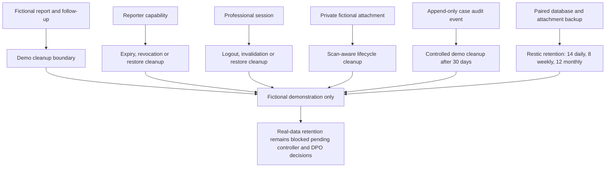

# Fictional-demo retention and deletion boundaries

Verified against the privacy engineering register, maintenance scripts and
recovery documentation on 24 August 2026.

**The property this diagram makes explicit: each fictional-data record has its
own bounded lifecycle; no diagram implies a real-data retention policy.**

Report and attachment cleanup use their own controlled jobs. Capabilities and
sessions are security state, so restoration explicitly truncates them rather
than reviving access. Case audit events are append-only except for the bounded
fictional-demo command. Backups retain paired database and attachment
generations, and recovery verifies the pair before accepting it.

## Verification sources

- [Privacy engineering register](../../security/privacy-engineering-register.md)
- [Fictional case-audit lifecycle](../../operations/case-audit-lifecycle.md)
- [Private attachment lifecycle](../../operations/attachment-lifecycle.md)
- [Encrypted backup and recovery](../../operations/backup-and-recovery.md)
- `infrastructure/maintenance/attachment-lifecycle.sh`
