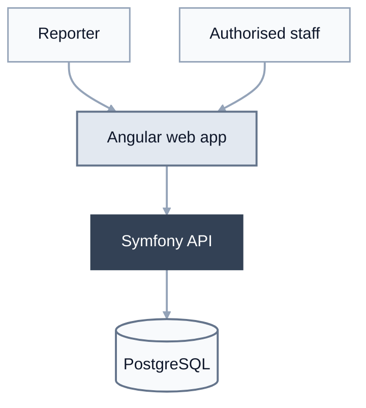

# Initial system architecture

This diagram shows the initial request path and the main technical boundaries of
Convive before application implementation begins.

## Boundaries represented

- Reporters and school professionals use different areas of the same Angular
  application.
- Angular is responsible for presentation and user-experience behaviour. It
  never accesses PostgreSQL directly.
- Angular communicates with Symfony through the versioned JSON HTTP API under
  `/api/v1`.
- Symfony is the authoritative business, authentication and authorisation
  boundary.
- Symfony accesses PostgreSQL through Doctrine ORM or DBAL according to the
  selected persistence rules.
- Professional access uses a stateful Symfony session. Anonymous follow-up uses
  a separate short-lived capability limited to one report.

## Deployment context

Docker Compose coordinates the application environment. The initial production
target is one controlled VPS serving the compiled Angular assets and running
Symfony and PostgreSQL. Development may use Angular's development tooling
without changing the logical boundaries shown above.

The particular reverse proxy, TLS implementation, backups, monitoring, email
provider and asynchronous infrastructure remain intentionally deferred.

## Related decisions

- [ADR-0002: Use a modular monolith for the backend](../decisions/0002-use-a-modular-monolith-for-the-backend.md)
- [ADR-0003: Use a separate web frontend](../decisions/0003-use-a-separate-web-frontend.md)
- [ADR-0004: Use Angular for the web frontend](../decisions/0004-use-angular-for-the-web-frontend.md)
- [ADR-0005: Use Docker Compose for reproducible environments](../decisions/0005-use-docker-compose-for-reproducible-environments.md)
- [ADR-0006: Use a resource-oriented JSON HTTP API with an OpenAPI contract](../decisions/0006-use-a-resource-oriented-json-http-api-with-an-openapi-contract.md)
- [ADR-0007: Use PostgreSQL and Doctrine for persistence](../decisions/0007-use-postgresql-and-doctrine-for-persistence.md)
- [ADR-0008: Use server-side sessions and capability-based anonymous access](../decisions/0008-use-server-side-sessions-and-capability-based-anonymous-access.md)
