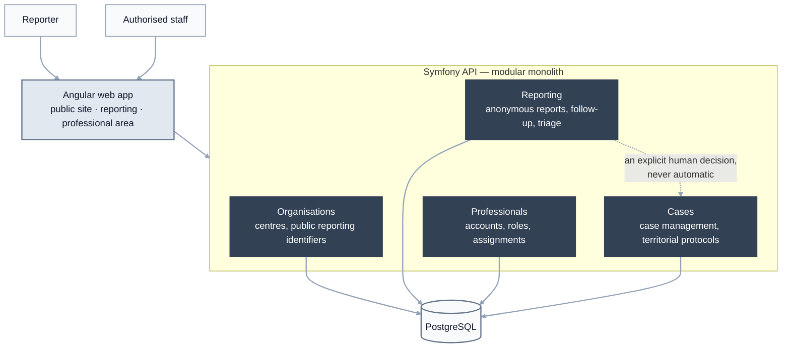

# System architecture

Convive's logical request path at container level, with the backend modules
that path reaches. Deployment and browser-routing details are recorded below
without turning this component view into a deployment diagram.

Verified against the codebase on 18 August 2026.

The container boundaries have not changed since this diagram was first drawn;
what changed is everything behind them. The original version showed one
undifferentiated "Symfony API" and described the reporting journey as still
under development, which stopped being true some time ago and left the whole
professional half of the product invisible to anyone reading it.

```mermaid
flowchart TB
    reporter["Reporter"]
    professional["Authorised staff"]
    web["Angular web app<br/>public site · reporting · professional area"]
    database[("PostgreSQL")]

    subgraph api["Symfony API — modular monolith"]
        direction TB
        organisations["Organisations<br/>centres, public reporting identifiers"]
        reporting["Reporting<br/>anonymous reports, follow-up, triage"]
        professionals["Professionals<br/>accounts, roles, assignments"]
        cases["Cases<br/>case management, territorial protocols"]
    end

    reporter --> web
    professional --> web
    web --> api
    reporting -.->|"an explicit human decision,<br/>never automatic"| cases
    organisations --> database
    reporting --> database
    professionals --> database
    cases --> database

    classDef actor fill:#F8FAFC,stroke:#94A3B8,color:#0F172A,stroke-width:1.5px
    classDef frontend fill:#E2E8F0,stroke:#64748B,color:#0F172A,stroke-width:2px
    classDef backend fill:#334155,stroke:#334155,color:#FFFFFF,stroke-width:2px
    classDef datastore fill:#F8FAFC,stroke:#64748B,color:#0F172A,stroke-width:2px
    class reporter,professional actor
    class web frontend
    class organisations,reporting,professionals,cases backend
    class database datastore
    linkStyle default stroke:#94A3B8,stroke-width:2px
```

## Boundaries represented

- Reporters and school professionals use different areas of the same Angular
  application.
- The backend is one deployable split into modules (ADR-0002). `Reporting` and
  `Cases` are deliberately separate: **a report is not a case**, and the arrow
  between them is a person's decision, not a state transition. Nothing is
  promoted automatically.
- `Cases` owns the territorial protocol model — nineteen jurisdictions, each
  citing its own source with its authority and version. A task states what a
  protocol says; it decides no obligation and computes no deadline.
- User-facing text is resolved in Angular through Transloco. Public content is
  gated on completeness, protocol content falls back to Spanish; the two
  guarantees differ deliberately (ADR-0026, ADR-0027).
- Angular is responsible for presentation and user-experience behaviour. It
  never accesses PostgreSQL directly.
- Angular communicates with Symfony through the versioned JSON HTTP API under
  `/api/v1`.
- Symfony is the authoritative business, authentication and authorisation
  boundary.
- Symfony accesses PostgreSQL through Doctrine ORM or DBAL according to the
  selected persistence rules.
- Professional access uses a stateful Symfony session. Anonymous follow-up uses
  a separate short-lived capability limited to one report.

## Deployment context

Docker Compose coordinates the application environment. The initial production
target is one controlled VPS serving the compiled Angular assets and running
Symfony and PostgreSQL. Development may use Angular's development tooling
without changing the logical boundaries shown above. In development, Angular's
server proxies the relative `/api/**` path to Symfony so the browser retains the
same-origin contract. In production, `/api/v1/**` reaches Symfony before the SPA
fallback, while other frontend routes may fall back to `index.html`.

The production ingress and trust topology are now selected in
[ADR-0012](../decisions/0012-use-cloudflare-tunnel-for-the-single-vps-deployment.md)
and shown in the
[single-VPS deployment diagram](single-vps-deployment.md). Backups, monitoring,
email delivery and asynchronous infrastructure remain separate decisions.

## Related decisions

- [ADR-0002: Use a modular monolith for the backend](../decisions/0002-use-a-modular-monolith-for-the-backend.md)
- [ADR-0003: Use a separate web frontend](../decisions/0003-use-a-separate-web-frontend.md)
- [ADR-0004: Use Angular for the web frontend](../decisions/0004-use-angular-for-the-web-frontend.md)
- [ADR-0005: Use Docker Compose for reproducible environments](../decisions/0005-use-docker-compose-for-reproducible-environments.md)
- [ADR-0006: Use a resource-oriented JSON HTTP API with an OpenAPI contract](../decisions/0006-use-a-resource-oriented-json-http-api-with-an-openapi-contract.md)
- [ADR-0007: Use PostgreSQL and Doctrine for persistence](../decisions/0007-use-postgresql-and-doctrine-for-persistence.md)
- [ADR-0008: Use server-side sessions and capability-based anonymous access](../decisions/0008-use-server-side-sessions-and-capability-based-anonymous-access.md)
- [ADR-0009: Use public organisation reporting links](../decisions/0009-use-public-organisation-reporting-links.md)
- [ADR-0012: Use Cloudflare Tunnel for the single-VPS deployment](../decisions/0012-use-cloudflare-tunnel-for-the-single-vps-deployment.md)
- [ADR-0017: Model report triage as append-only decisions](../decisions/0017-model-triage-as-append-only-decisions.md)
- [ADR-0018: Require explicit assignments for case content](../decisions/0018-require-case-assignments-for-case-content.md)
- [ADR-0026: Use Transloco for runtime internationalisation](../decisions/0026-use-transloco-for-runtime-internationalisation.md)
- [ADR-0027: Derive protocol translation keys and fall back to Spanish](../decisions/0027-derive-protocol-translation-keys-and-fall-back-to-spanish.md)
