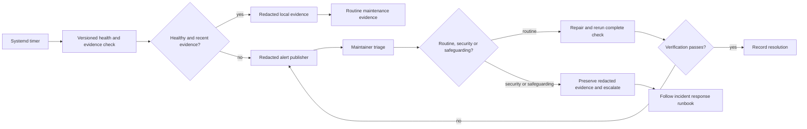

# Observability, alerting and incident response

Verified against `infrastructure/observability/`, the systemd units and the
[incident-response runbook](../../operations/incident-response.md) on
24 August 2026.

**The property this diagram makes explicit: an operational failure stops the
unsafe action, retains only redacted evidence, and then requires triage.**

Checks and evidence stay on the controlled host. They exclude report content,
access secrets, session identifiers, attachment identifiers, credentials and
unredacted environment data. An alert is not evidence of a staffed 24/7
service, and the fictional demonstration remains bounded by its operational
runbooks.

## Verification sources

- [Incident response and observability](../../operations/incident-response.md)
- `infrastructure/observability/check.sh`
- `infrastructure/observability/alert.sh`
- `infrastructure/observability/exercise-failure.sh`
- `infrastructure/observability/systemd/`
