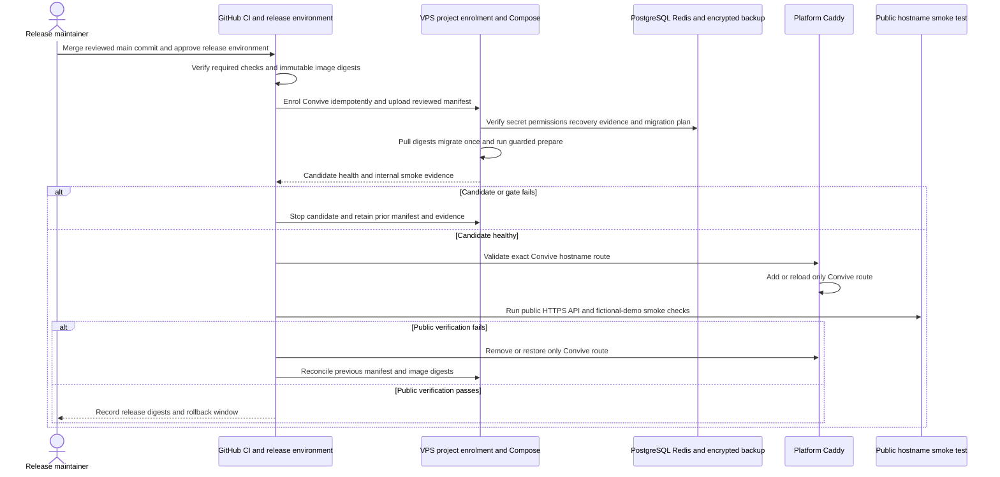

# Controlled release and rollback sequence

**Property made obvious:** Convive becomes public only after a prepared, healthy candidate and a reviewed Caddy route; a failed gate stops rather than falls back to a development build, a host port or another project's route.

**Status:** maintained fictional-demo release procedure  
**Last reviewed:** 25 August 2026

This sequence is the required procedure, not evidence of a completed public deployment. It follows the [deployment, release and rollback runbook](../../operations/deployment-release-and-rollback.md), [ADR-0029](../decisions/0029-use-the-platform-caddy-per-project-edge-for-public-ingress.md) and the [release workflow](../../../.github/workflows/release.yaml).

## Rollback decision points

| Condition | Action | Must not happen |
| --- | --- | --- |
| Prepare, health or migration gate fails | Keep candidate non-public and retain evidence | Expose a host port or use a development image |
| No migration ran | Select previous manifest and repeat complete smoke test | Delete volumes or run host-wide Docker cleanup |
| Backward-compatible migration ran | Restore previous image digests and leave compatible schema | Automatic Doctrine `down()` |
| Incompatible migration or unrecoverable state | Keep maintenance active, restore verified generation, select previous digests and retest | Serve an uncertain state |
| Caddy/DNS verification fails | Remove or restore the Convive route only | Edit/restart another ProjectX app or introduce a tunnel |

The release record contains commit, PR, approved immutable digests, migration class, backup evidence, operator, smoke result and rollback outcome, never secret values. The Caddy route is added after preparation so a bad candidate cannot accidentally become public.

## Sources and verification

- [Controlled release workflow](../../operations/controlled-release-workflow.md)
- [Deployment, release and rollback runbook](../../operations/deployment-release-and-rollback.md)
- [Release record template](../../operations/release-records/TEMPLATE.md)
- [Production reconciliation script](../../../infrastructure/release/reconcile.sh)
- `npm run docs:check`
