# Security data-flow and trust boundaries

**Property made obvious:** possession of a reporter secret, a professional session and an operational secret are three separate credentials; none may be silently upgraded into another.

**Status:** maintained fictional-demo security view  
**Last reviewed:** 25 August 2026

The flows below are derived from [ADR-0008](../decisions/0008-use-server-side-sessions-and-capability-based-anonymous-access.md), [ADR-0012](../decisions/0012-use-cloudflare-tunnel-for-the-single-vps-deployment.md) (historical ingress decision, superseded), [ADR-0013](../decisions/0013-use-restic-with-off-host-object-storage-for-database-recovery.md), the [attachment threat model](../../security/attachment-threat-model.md) and [ADR-0029](../decisions/0029-use-the-platform-caddy-per-project-edge-for-public-ingress.md). They describe fictional demonstration controls, not real-data approval.

```mermaid
flowchart LR
    reporter[Untrusted reporter browser]
    professional[Professional browser]
    operator[Release operator / CI]
    edge[Cloudflare and platform Caddy - reviewed HTTPS boundary]
    gateway[Gateway - same-origin Angular and API route]
    api[Symfony security boundary]
    database[(PostgreSQL)]
    redis[(Redis)]
    quarantine[Private quarantine storage]
    scanner[ClamAV scanner]
    available[Private available evidence]
    backup[Encrypted restic backup to private R2]
    secrets[Root-owned secret files]
    registry[Immutable GHCR image digests]

    reporter -->|fictional content and one-time secret response| edge
    professional -->|professional session cookie| edge
    edge --> gateway --> api
    api -->|hashed reporter secret, content and audit data| database
    api -->|rate-limit and transient state| redis
    api -->|untrusted attachment bytes| quarantine
    quarantine -->|scan request| scanner
    scanner -->|clean result required| available
    available -->|authorised mediated read only| api
    database -->|encrypted recovery copy| backup
    available -->|encrypted recovery copy| backup
    operator -->|approved workflow| registry
    registry -->|digest-pinned release| gateway
    secrets -->|file-mounted runtime configuration| api
```

## Trust-boundary controls

| Flow | Data class | Enforced control |
| --- | --- | --- |
| Reporter to API | Fictional report/follow-up content and one-time secret | HTTPS, validation, rate limits; secret shown once and stored as a hash |
| Reporter capability | Scoped anonymous credential | HttpOnly cookie, short expiry, one-report scope and revocation; cannot authenticate a professional |
| Professional to API | Session and requested case action | Server-side session validation, active membership and exact case permission; UI is not authority |
| Attachment lifecycle | Untrusted fictional evidence bytes and scan status | Private quarantine, fail-closed scan and application-mediated authorised retrieval |
| Runtime configuration | Operational secret values | Root-owned file mounts; no secrets in Git, URLs, logs or release records |
| Release supply chain | Reviewed image digests and release metadata | Protected review, approval, immutable digest selection and health gates |
| Backup and recovery | Encrypted fictional persistent data | Private off-host repository, controlled restore and access-invalidation review |

The current ingress decision is platform Caddy in ADR-0029. Caddy and Cloudflare govern the network edge only; Symfony remains the authorisation boundary. The [C4 context](c4-context.md) and [C4 container](c4-container.md) views show the same topology at different levels.

## Sources and verification

- [Threat model](../../security/threat-model.md)
- [Privacy engineering register](../../security/privacy-engineering-register.md)
- [Attachment threat model](../../security/attachment-threat-model.md)
- [Release workflow](../../../.github/workflows/release.yaml)
- `npm run docs:check`
