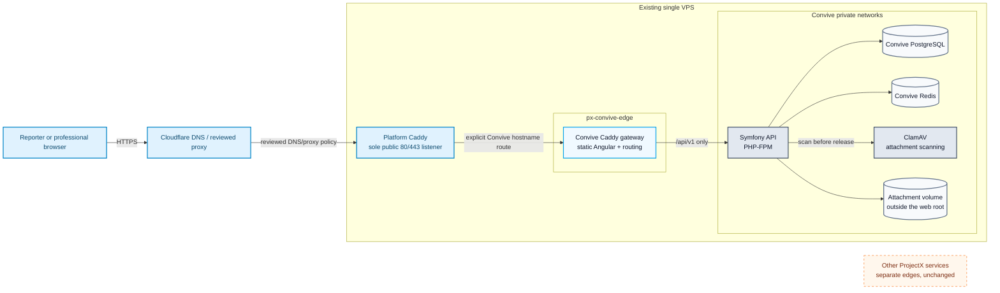

# Single-VPS deployment topology

This deployment view implements
[ADR-0029](../decisions/0029-use-the-platform-caddy-per-project-edge-for-public-ingress.md).
It describes the fictional-data demonstration; it is not a real-data approval.

Every service in `infrastructure/production/compose.production.yaml` appears
here: `gateway`, `api`, `database`, `redis` and `clamav`, plus the attachment
volume its init container prepares. Platform Caddy is the only process that
accepts public HTTP(S) traffic on the VPS.

## Trust boundaries

1. **Public Internet to Cloudflare:** Cloudflare provides DNS and, only when
   deliberately enabled, a reviewed proxy policy. It is not a Convive Tunnel or
   an application access-control layer.
2. **Cloudflare to platform Caddy:** Caddy is the VPS's sole public listener.
   Convive publishes no host port and runs no `cloudflared` connector.
3. **Platform Caddy to Convive edge:** only platform Caddy and the Convive
   gateway join `px-convive-edge`. The explicit hostname route is installed
   only after Convive health checks pass.
4. **Gateway to API:** only `/api/v1/**` reaches PHP-FPM on Convive's private
   internal network. The SPA fallback cannot consume an API route.
5. **API to state:** PostgreSQL and Redis use separate internal networks and
   are reachable only by Symfony. The scanner has a distinct signature-refresh
   egress and never shares database, Redis or attachment storage networks.
6. **Host coexistence:** ProjectX projects share physical resources only. They
   do not share Convive volumes, secrets, Compose ownership or release steps.

Symfony trusts only the Convive gateway's private proxy address. Platform
Caddy and the gateway replace untrusted forwarding headers; public clients
cannot select the address used by rate-limiting logic.

## Data and control paths

- Fingerprinted Angular assets may be cached publicly; HTML, API traffic,
  anonymous access and follow-up responses are not cached.
- PostgreSQL is authoritative for fictional product data and professional
  sessions. Redis contains expiring idempotency and abuse-control state.
- CI publishes immutable images. The VPS pulls reviewed digests from GHCR.
- Operators first prepare healthy Convive services, then validate and install
  the one Caddy route, then complete public smoke verification. Secrets never
  enter an image or release manifest.
- Backups leave the live Compose project through the separately controlled
  backup process defined by issue #66.
