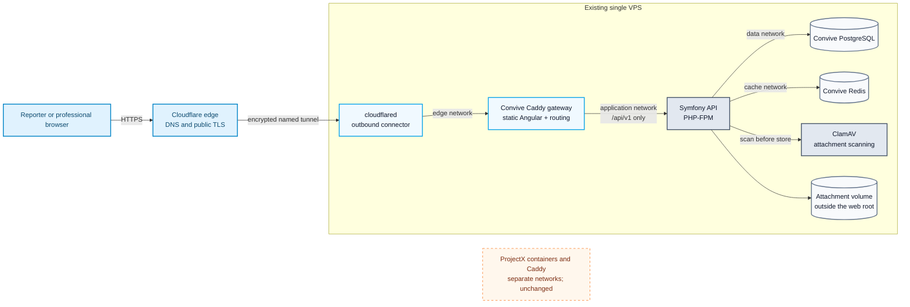

# Single-VPS deployment topology

This deployment view implements
[ADR-0012](../decisions/0012-use-cloudflare-tunnel-for-the-single-vps-deployment.md).
It describes the fictional-data demonstration; it is not a real-data approval.

Verified against `infrastructure/production/compose.production.yaml` on
18 August 2026. Every service in that file appears here: `cloudflared`,
`gateway`, `api`, `database`, `redis` and `clamav`, plus the attachment volume
its init container prepares.

ClamAV was previously missing from this diagram. A reader reasoning about what
happens to an uploaded file would have concluded nothing scans it.

## Trust boundaries

1. **Public Internet to Cloudflare:** Cloudflare is the public TLS endpoint and
   an external data processor. No request has reached a Convive-controlled host
   at this boundary.
2. **Cloudflare to connector:** `cloudflared` creates outbound-only connections.
   The VPS firewall exposes no Convive ingress port.
3. **Connector to gateway:** only `cloudflared` and `gateway` share the Convive
   `edge` network. The gateway is the only application-facing ingress.
4. **Gateway to API:** only `/api/v1/**` reaches PHP-FPM on the internal
   `application` network. The SPA fallback cannot consume an API route.
5. **API to state:** PostgreSQL and Redis use separate internal networks and are
   reachable only by Symfony. Neither publishes a host port.
6. **Host coexistence:** ProjectX shares physical host resources only. It does
   not share Convive networks, volumes, secrets, Compose ownership or release
   operations.

Forwarded client addresses cross two trusted hops. The gateway replaces
untrusted forwarding headers using connector-provided information, and Symfony
trusts only the gateway. Public clients cannot select the address used by
rate-limiting logic.

## Data and control paths

- Fingerprinted Angular assets may be cached publicly; HTML, API traffic,
  anonymous access and follow-up responses are not cached.
- Authoritative product data and professional sessions are stored in
  PostgreSQL. Redis contains expiring shared idempotency records and
  abuse-control counters.
- CI publishes immutable images. The VPS pulls reviewed digests from GHCR.
- Operators supply a release manifest and service-scoped secret files. Secrets
  never flow through the frontend image or repository.
- Backups leave the live Compose project through the separately controlled
  backup process defined by issue #66.
