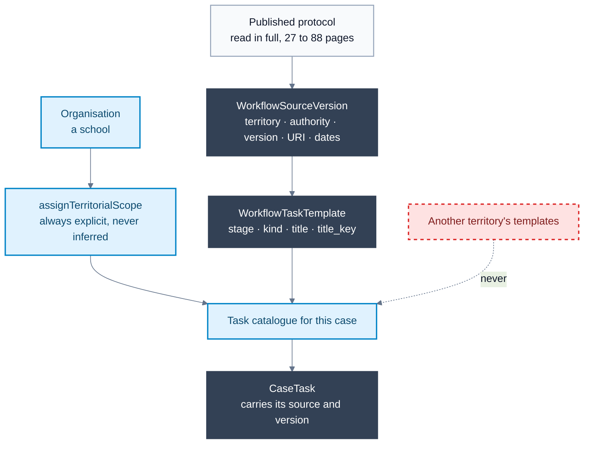

# Territorial protocol model

Verified against the codebase and database on 18 August 2026.

**The property this diagram exists to make obvious: one territory's protocol
can never reach another territory's school, and a task states what a source
says rather than deciding anything.**

Nineteen jurisdictions are modelled — the seventeen autonomous communities plus
Ceuta and Melilla — each against its own published protocol.

## The two rules the model enforces

**Isolation.** A school sees only its own territory's templates. Every
territorial migration ships a test asserting both directions: the scoped
catalogue is 100% that territory, and an unrelated territory's workspace never
sees it. Twenty such tests exist, and they are the reason the dashed arrow
above is drawn at all — it is the failure they are written to catch.

**Citation, not decision.** A template states what the source says. It decides
no obligation and computes no deadline. Where a source sets a deadline, the
deadline is quoted with the source's own units; where a source sets none, none
is invented.

## Authority is load-bearing

`binding` · `recommended` · `internal`.

Of the nineteen jurisdictions, eleven are `binding` and seven `recommended`.
The distinction is not cosmetic: it changes what may be asked of a school.
Galicia is recorded as `recommended` because its obligations live in Lei 4/2011
and Decreto 8/2015 while the protocol document itself never declares itself
preceptivo. Marking it `binding` would have been an easy and invisible
overstatement.

## Two territories set no deadlines at all

Galicia defers to the corrective procedure; Navarra's article 15 states none.
Both carry a test forbidding any template in that scope from containing a day
or hour count, so a future well-meaning edit cannot quietly supply one.

Navarra is the sharper case. Its only number caps a **mediation** so that it
counts as a mitigating circumstance — not a deadline for responding. Rendering
that as "eight school days" would have invented an obligation and implied the
response to a child could wait that long.

## Translation

Titles are Spanish, and each template carries a key derived from
`(territory, stage)`. Missing translations fall back to the Spanish source
rather than showing a raw key — see the
[translation pipeline](translation-pipeline.md) and ADR-0027.

## Related decisions

- [ADR-0019: Version workflow sources and require explicit task resolution](../decisions/0019-version-case-workflow-sources-and-require-explicit-task-resolution.md)
- [ADR-0023: Map Andalusian centre responsibilities to least-privilege grants](../decisions/0023-map-andalusian-centre-responsibilities-to-least-privilege-grants.md)
- [ADR-0027: Derive protocol translation keys and fall back to Spanish](../decisions/0027-derive-protocol-translation-keys-and-fall-back-to-spanish.md)
