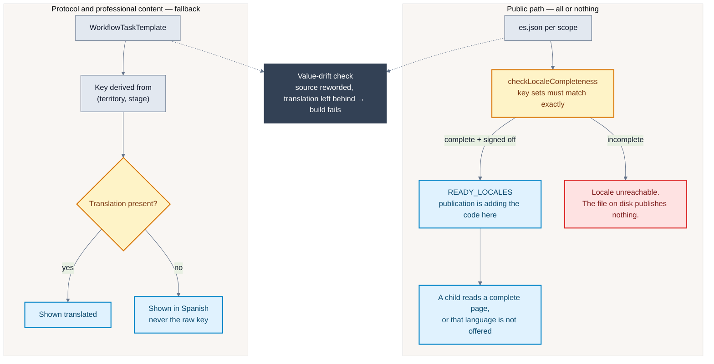

# Translation pipeline: two guarantees, on purpose

Verified against the codebase on 18 August 2026.

**The property this diagram exists to make obvious: public content and protocol
content are protected differently, and the difference is deliberate.**

Confusing the two is how a half-translated page reaches a child, or how a
professional mid-case is shown a raw translation key. Both are real failures;
they need opposite defences.

## Why they differ

**Public content is gated** because a child arriving in difficulty must not
meet a page that reverts to Spanish mid-sentence, or leaks a key to the screen.
A page that is not fully translated is worse than a page that does not exist in
that language. So the locale is simply not offered.

**Protocol content falls back** because gating it would mean a professional in
Catalonia could not select Catalan until every template title across nineteen
territories had been translated — including territories they will never open.
And the failure mode is different: a professional reading one Spanish title
inside an otherwise Catalan page has lost nothing. A raw key such as
`caseWorkflow.template.es_md.assessment` mid-case teaches them nothing at all.

The two harms are not the same, so the two defences are not the same.

## The third property: drift

Both gates compare **structure**. Neither can see a Spanish string being
reworded underneath a translation that stays put — the key still exists
everywhere, so every check passes while published locales state the previous
version of a safety notice.

A separate check records the source text each locale was confirmed against and
fails the build when they diverge. Re-confirming is one command per locale, and
it prints every key it is about to bless, because confirming asserts a human
read that string in that language.

## Published today

`es` · `ca` · `ca-valencia` · `ar` · `gl`

Basque is drafted work held on #312: not for lack of effort, but because
comprehension cannot be certified by whoever wrote the text, and Basque is a
language isolate where a mistake reads as fluent Basque saying something
slightly different.

## Related decisions

- [ADR-0026: Use Transloco for runtime internationalisation](../decisions/0026-use-transloco-for-runtime-internationalisation.md)
- [ADR-0027: Derive protocol translation keys and fall back to Spanish](../decisions/0027-derive-protocol-translation-keys-and-fall-back-to-spanish.md)
- [Locale process](../../content/i18n-process.md)
